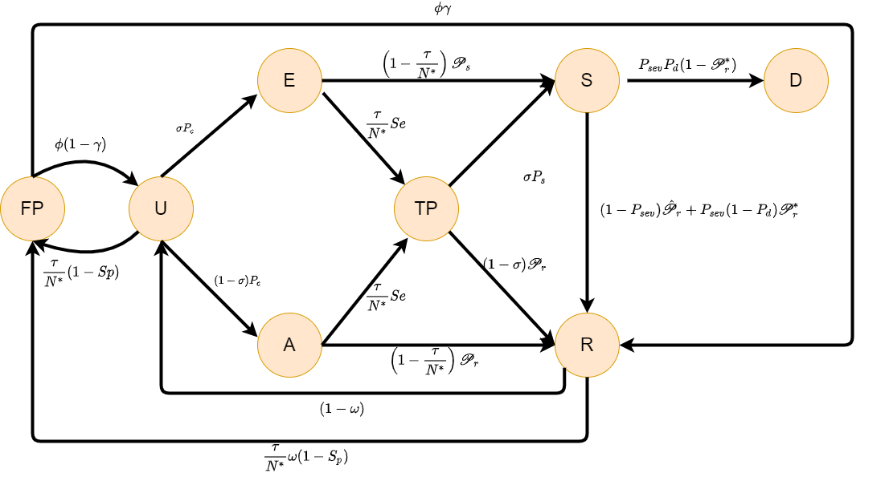

```{r setup, include=FALSE}
knitr::opts_chunk$set(echo = TRUE)
```

::: {style="text-align: justify"}
Since the beginning of the COVID-19 epidemic, mitigation measures have been implemented in each country to prevent the increase of positive cases. One of the main ones has been the suspension of face-to-face classes at all levels of education. However, the reopening of schools has not been an easy decision to make, especially when financial resources are limited to implement both vaccination and screening strategies in the entire population. Thus, the need arises to evaluate the effectiveness of case reduction, having vaccination and screening strategies within the school, while schools maintain strict sanitary measures during different scenarios of the external epidemic.

In order to address this problem, a mathematical compartmental discrete model is proposed in @RuthTesis, whose dynamic follows the diagram shown in Figure \ref{fig_model} and its compartments are: Susceptibles **(U)**, Presymptomatics **(E)**, Asymptomatics **(A**), True Positives **(TP)**, False Positives **(FP)**, Symptomatics **(S)**, Recovered **(R)** and Deaths **(D)**. And the equations of the model are shown in (\ref{ecs: Modelo 1}). The model equations are shown in \ref{ecs: Modelo 1}.
:::



$$
\begin{align}
\label{ecs: Modelo 1}
U(n+1)&=U(n)C_eC_f\left[1-\frac{\tau}{N^*(n)}(1-Sp)\right]+(1-\gamma)\phi FP(n)+ R(n)(1-\omega) \nonumber\\ \nonumber
E(n+1)&=\sigma U(n)\left(1-C_eC_f\right)+E(n)\left[\frac{\tau}{N^*(n)}(1-Se)+\left(1-\frac{\tau}{N^*(n)}\right)(1-\mathscr{P}_s)\right]\\ \nonumber
A(n+1)&= (1-\sigma)U(n)\left(1-C_eC_f\right)+A(n)\left[\frac{\tau}{N^*(n)}(1-Se)+\left(1-\frac{\tau}{N^*(n)}\right)(1-\mathscr{P}_r)\right] \nonumber\\ 
TP(n+1)&= E(n)\frac{\tau}{N^*(n)} Se+A(n)\frac{\tau}{N^*(n)} Se+TP(n)\left[(1-\sigma)(1-Pr)+ \sigma(1-\mathscr{P}_s)\right] \nonumber\\ 
FP(n+1)&=U(n)\frac{\tau}{N^*(n)}(1-Sp)C_eC_f+(1-\phi)FP(n)+  R(n)\omega\frac{\tau}{N^*(n)}(1-S_p)\nonumber\\ \nonumber
S(n+1)&=E(n)\left(1-\frac{\tau}{N^*(n)}\right)\mathscr{P}_s+TP(n)\sigma \mathscr{P}_s+ S(n)\left[(1-P_{sev})(1-\hat{\mathscr{P}_r})\right. +\left.P_{sev}(1-P_d)(1-\mathscr{P}_r^*) \right] \nonumber\\
R(n+1)&=TP(n)(1-\sigma) \mathscr{P}_r+A(n)\left(1-\frac{\tau}{N^*(n)}\right)\mathscr{P}_r+S(n)\left[(1-P_{sev})\hat{\mathscr{P}_r}\right. \nonumber\\
&+ \left. P_{sev}(1-P_d)\mathscr{P}_r^*\right]+R(n)\omega\left[\frac{\tau}{N^*(n)} S_p+\left(1-\frac{\tau}{N^*(n)}\right)\right] +\gamma\phi FP(n) \nonumber\\ %+\frac{\phi}{2} FP(n) \\ \nonumber
D(n+1)&=D(n) + S(n)P_{sev}P_d
\end{align}
$$

::: {style="text-align: justify"}
The model (\ref{ecs: Modelo 1}) was used in @RuthTesis in order to analyse and to evaluate possible scenarios after the reopening of schools during 136 days, projecting over August to December 2021 and combining different behaviors of the external epidemic in [Santiago de Querétaro](https://www.google.com.br/maps/place/Santiago+de+Quer%C3%A9taro,+Qro.,+M%C3%A9xico/@20.6122835,-100.4802582,12z/data=!3m1!4b1!4m5!3m4!1s0x85d35b8fdc5b9255:0x97b094aa561b832f!8m2!3d20.5887932!4d-100.3898881), which is a city in the center of Mexico whose population is 1.05 million inhabitants. Consequently, the parameters and data included in this repository correspond to Santiago de Querétaro (`QUERETARO_CAP`)

## Woklflow

The analysis of the mathematical model and the simulations shown in @RuthTesis involves three stages, which require the execution of the codes included in this repository in the following way:

1.  **Analytic computation of the basic reproductive number (**$R_0$): Based on @allen2008basic, the next generation matrix of the model is computed in order to get the mathematical expressions of $R_0$ and the probability of effective contact ($\beta$). These expressions are required to define the probability of infectious $P_c$ within the code that performs the simulations and they are already included.

    Code: "codes/Mathematica/R0_computation.nb"

2.  **Probability densities estimation and sampling:** Probability distributions adjustment of $P_{sev}$ and $P_d$ are made for a specific age-defined sector of the population. After this, the sampling of the probability densities $\sigma$, $\mathscr{P}_s$, $\mathscr{P}_r$, $\hat{\mathscr{P}_r}$, $\mathscr{P}_r^*$, $P_{sev}$ and $P_d$ to set them as fixed parameters during the simulations.

    Raw database: *210801COVID19MEXICO.csv* downloaded from the [official website](https://www.gob.mx/salud/documentos/datos-abiertos-bases-historicas-direccion-general-de-epidemiologia) of the Mexican Ministry of Health.

    Code: *"codes/R/run_distributions.R"*.

    Required packages: `dplyr`, `fitdistrplus`

    Output example: *"output/DistProb_VacYES.csv"*

3.  **Run simulations.**

    Code: "*codes/R/run_simulation.R*".

    Required packages: `dplyr`, `interp`, `tidyr`, `plotly`

    Outputs example:

    -   "*output/QUERETARO_CAP_2021-05-01_2021-09-15_VacYES_bEsc0.1_Tot1000_w0_Test1_tau0.05_A0E03.csv*".

    -   The simulation plots are made with `plotly` package so they are displayed directly in the "Plots" panel of RStudio.

The Wolfram Mathematica 12.2 and R version 4.1.1 were used to develop the .nb and .R codes in this repositoty.
:::

## Databases required:

The following databases must be storage in `data`folder.

-   *210801COVID19MEXICO.csv* downloaded from the [official website](https://www.gob.mx/salud/documentos/datos-abiertos-bases-historicas-direccion-general-de-epidemiologia) of the Mexican Ministry of Health. This is a free official database with the register of each COVID19 case in Mexico since the beginning of the epidemic in February, 2020 until August 1st, 2021. In the [official website](https://www.gob.mx/salud/documentos/datos-abiertos-bases-historicas-direccion-general-de-epidemiologia) all the databases daily updated are allowed, so its possible to replicate the density probability estimations with a database updated in a different date.

    The database has the following 40 variables registered by columns: FECHA_ACTUALIZACION, ID_REGISTRO, ORIGEN, SECTOR, ENTIDAD_UM, SEXO, ENTIDAD_NAC, ENTIDAD_RES, MUNICIPIO_RES, TIPO_PACIENTE, FECHA_INGRESO, FECHA_SINTOMAS, FECHA_DEF, INTUBADO, NEUMONIA, EDAD, NACIONALIDAD, EMBARAZO, HABLA_LENGUA_INDIG, INDIGENA, DIABETES, EPOC, ASMA, INMUSUPR, HIPERTENSION, OTRA_COM, CARDIOVASCULAR, OBESIDAD, RENAL_CRONICA, TABAQUISMO, OTRO_CASO, TOMA_MUESTRA_LAB, RESULTADO_LAB, TOMA_MUESTRA_ANTIGENO, RESULTADO_ANTIGENO, CLASIFICACION_FINAL, MIGRANTE, PAIS_NACIONALIDAD, PAIS_ORIGEN, UCI. The meaning of each variable is described in -------------------------

-   *covidestim_QUERETARO_CAP.csv* is a database provided by Nodo Multidisciplinario de Matemáticas Aplicadas ([NoMAA](https://www.matem-juriquilla.unam.mx/NoMMA-Covid)) of the Universidad Nacional Autónoma de México (UNAM) which contain the estimation of real cases computed with [covidestim R package](https://covidestim.org/). The database has the following 41 variables whose meaning can found in this [link](https://pkg.covidestim.org/reference/summary.covidestim_result.html): date, cases.fitted, cases.fitted.hi, cases.fitted.lo, cum.incidence, cum.incidence.hi, cum.incidence.lo, deaths, deaths.diagnosed, deaths.diagnosed.hi, deaths.diagnosed.lo, deaths.fitted, deaths.fitted.hi, deaths.fitted.lo, deaths.hi, deaths.lo diagnoses, diagnoses.hi, diagnoses.lo, infections, infections.hi, infections.lo, pop.infectiousness, pop.infectiousness.hi, pop.infectiousness.lo, Rt, Rt.hi, Rt.lo, sero.positive, sero.positive.hi, sero.positive.lo, severe, severe.hi, severe.lo, symptomatic, symptomatic.diagnosed, symptomatic.diagnosed.hi, symptomatic.diagnosed.lo, symptomatic.hi, symptomatic.lo, data.available, index. @Moreno2021

## Databases generated:

The following database must be storage in `output`folder.

-   *DistProb_VacYES.csv* is an example of a dataset generated by the "*run_distributions.R"* script which includes the parameter values of the density distributions taken in each unit of time of simulations. The column variables are: Ps_output, Pr_output, Pr2_output, Pr3_output, sigma_output, Psev_output, Pd_output.

## References
